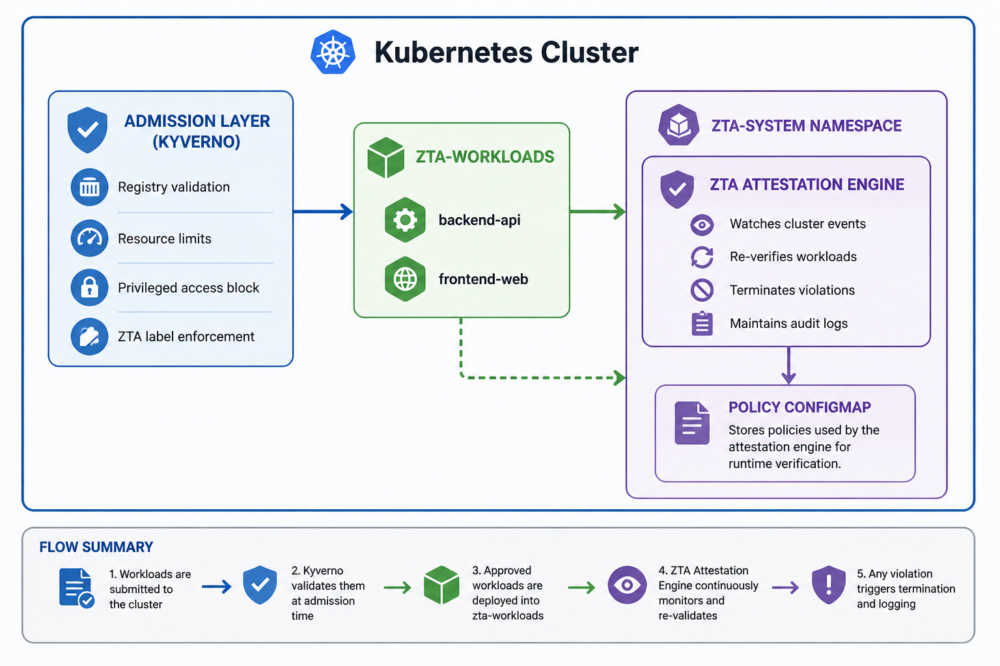

# Continuous Pod Attestation: Zero Trust Architecture for Kubernetes


> A research prototype implementing Continuous Zero Trust Architecture (ZTA)
> for dynamic Kubernetes workloads. Submitted for consideration at
> IEEE Transactions on Industrial Informatics (IEEE TII).

---

## 📋 Table of Contents

- [Overview](#overview)
- [Problem Statement](#problem-statement)
- [Architecture](#architecture)
- [Project Structure](#project-structure)
- [Quick Start](#quick-start)
- [Components](#components)
- [Evaluation Results](#evaluation-results)
- [Technologies](#technologies)
- [License](#license)

---

## Overview

Modern Kubernetes environments are highly dynamic — pods are continuously
created, restarted, scaled, and replaced. Most Zero Trust implementations
verify workloads **only once** at admission time, creating a **trust drift**
problem where running pods may no longer comply with security policies.

This project implements a **Continuous Pod Attestation System** that
re-verifies every pod on every lifecycle event — creation, restart,
scaling, and deployment rollouts — with automatic remediation.

---

## Problem Statement

| Current State | This System |
|---|---|
| Pods verified once at admission | Pods verified on every lifecycle event |
| Restarted pods trusted blindly | Restarted pods fully re-attested |
| Config drift goes undetected | Config violations caught in <1 second |
| Scaling spawns unverified pods | Every new replica individually verified |

---

## Architecture

<p align="center">
  
</p>

---

## Project Structure
```bash
├── admission-policies/          # Kyverno admission policies
│   ├── policy-approved-registries.yaml
│   ├── policy-require-limits.yaml
│   ├── policy-disallow-privileged.yaml
│   └── policy-require-zta-label.yaml
│
├── engine/                      # Core attestation engine
│   ├── zta_engine.py            # Production in-cluster engine
│   ├── zta_controller.py        # Standalone controller (dev)
│   ├── Dockerfile
│   └── requirements.txt
│
├── manifests/                   # Kubernetes manifests
│   ├── zta-rbac.yaml            # ServiceAccount + ClusterRole
│   ├── zta-config.yaml          # Policy ConfigMap
│   ├── zta-engine-deployment.yaml
│   └── sample-app.yaml          # Test workloads
│
├── evaluation/                  # Results and metrics
│   ├── metrics_collector.py
│   ├── metrics_collector_v2.py
│   ├── final-audit.log
│   └── RESULTS_SUMMARY.md
│
├── docs/                        # Documentation
│   ├── SETUP.md
│   ├── ARCHITECTURE.md
│   └── figures/
```
---

## Quick Start

### Prerequisites

- Ubuntu 22.04+ / Debian-based Linux
- 4GB+ RAM, 4 CPU cores
- Docker, kubectl, Minikube, Helm

### 1. Clone the repository

```bash
git clone https://github.com/YOUR_USERNAME/zta-kubernetes.git
cd zta-kubernetes
```

### 2. Start Minikube

```bash
minikube start \
  --driver=docker \
  --cpus=4 \
  --memory=4400 \
  --kubernetes-version=v1.32.0 \
  --addons=metrics-server
```

### 3. Deploy infrastructure

```bash
# Namespaces and RBAC
kubectl create namespace zta-system
kubectl create namespace zta-workloads
kubectl create namespace monitoring
kubectl apply -f manifests/zta-rbac.yaml
kubectl apply -f manifests/zta-config.yaml

# Sample workloads
kubectl apply -f manifests/sample-app.yaml
```

### 4. Install Kyverno and apply policies

```bash
helm repo add kyverno https://kyverno.github.io/kyverno/
helm repo update
helm install kyverno kyverno/kyverno \
  --namespace kyverno \
  --create-namespace \
  --set admissionController.replicas=1 \
  --set backgroundController.enabled=true \
  --set cleanupController.enabled=false \
  --set reportsController.enabled=false

kubectl apply -f admission-policies/
```

### 5. Build and deploy the attestation engine

```bash
eval $(minikube docker-env)
docker build -t zta-engine:v1.0 engine/
kubectl apply -f manifests/zta-engine-deployment.yaml
```

### 6. Verify everything is running

```bash
kubectl get pods -n zta-system
kubectl get pods -n zta-workloads
kubectl get clusterpolicy
kubectl logs -n zta-system deployment/zta-attestation-engine --tail=20
```

---

## Components

### Admission Control Layer (Kyverno)
| Policy | Description | Action |
|--------|-------------|--------|
| `require-approved-registries` | Only docker.io, gcr.io, registry.k8s.io allowed | Enforce |
| `require-resource-limits` | All containers must declare CPU/memory limits | Enforce |
| `disallow-privileged-containers` | No container may run in privileged mode | Enforce |
| `require-zta-label` | All pods must carry `zta-monitored=true` | Enforce |

### Runtime Attestation Engine
- Watches all pod lifecycle events via Kubernetes API watch stream
- Classifies events: `POD_CREATED`, `POD_MODIFIED`, `POD_RESTARTED`, `POD_DELETED`
- Runs 5 attestation checks on every event
- Writes structured JSON audit log for every decision
- Auto-terminates non-compliant pods

### Attestation Checks
| Check | Description |
|-------|-------------|
| ZTA Label | Pod must carry `zta-monitored=true` |
| Approved Registry | Image must come from trusted registry |
| Resource Limits | CPU and memory limits must be defined |
| No Privileged Mode | Container must not run as privileged |
| Restart Threshold | Restart count must be below threshold |

---

## Evaluation Results

### Attestation Summary
| Metric | Value |
|--------|-------|
| Total Attestation Events | 66 |
| Passed | 56 (84.85%) |
| Failed (Violations) | 10 (15.15%) |
| Pods Auto-Terminated | 10 |
| Undetected Violations | 0 |
| Detection Latency | <1 second |

### Test Scenarios
| Scenario | Description | Result |
|----------|-------------|--------|
| S1 | Pod Crash & Restart Detection | ✅ 21 restart events attested |
| S2 | Unauthorized Config Modification | ✅ 2 violation types detected <1s |
| S3 | Scaling Event Validation | ✅ All 6 replicas verified |
| S4 | Deployment Rollout Verification | ✅ New image attested end-to-end |

---

## Technologies

| Tool | Version | Purpose |
|------|---------|---------|
| Kubernetes | v1.32.0 | Orchestration platform |
| Minikube | v1.38.1 | Local cluster |
| Kyverno | v1.17.1 | Admission control |
| Python | 3.11 | Controller implementation |
| kubernetes-python SDK | 31.0.0 | Kubernetes API client |
| Docker | 29.2.1 | Container runtime |
| Helm | v3.20.2 | Package management |

---

## License

MIT License — see [LICENSE](LICENSE) for details.
